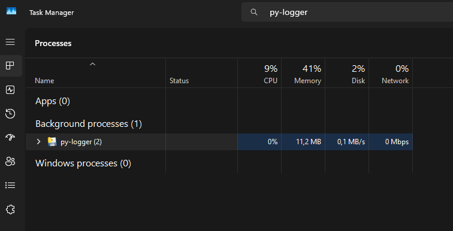

# 🖥 Python Simple Logger

Sebuah program sederhana berbasis Python untuk merekam penekanan tombol (keylogging) menggunakan library `pynput`.  
Program ini juga bisa dikonversi menjadi file executable (`.exe`) yang berjalan di background tanpa menampilkan jendela console.

---

## ⚠ Disclaimer

Program ini dibuat hanya untuk tujuan edukasi & pengujian keamanan **dengan izin** pihak terkait.
Menggunakan keylogger tanpa izin adalah **ilegal** dan melanggar privasi.

---

## 📽️ Demo


---

## 📦 Persiapan Lingkungan Virtual & Instalasi Library

1. **Pindah ke direktori proyek**  

   ```bash
   cd path/to/project
    ```

2. **Buat dan aktifkan virtual environment**

   * **Linux / macOS**

     ```bash
     python -m venv venv
     source venv/bin/activate
     ```

   * **Windows (Command Prompt)**

     ```cmd
     python -m venv venv
     venv\Scripts\activate
     ```

3. **Install library yang dibutuhkan**

   ```bash
   pip install pynput
   pip install pyinstaller
   ```

---

## ⚙ Instalasi `make` di Windows

> `make` biasanya tersedia di Linux/Mac, tapi di Windows bisa di-install menggunakan **Chocolatey**.

1. **Install Chocolatey** (jika belum)

   * Buka PowerShell **sebagai Administrator**
   * Jalankan:

     ```powershell
     Set-ExecutionPolicy Bypass -Scope Process -Force; `
     [System.Net.ServicePointManager]::SecurityProtocol = `
     [System.Net.ServicePointManager]::SecurityProtocol -bor 3072; `
     iex ((New-Object System.Net.WebClient).DownloadString('https://community.chocolatey.org/install.ps1'))
     ```

2. **Install `make`**

   ```powershell
   choco install make
   ```

3. **Cek instalasi**

   ```powershell
   make --version
   ```

---

## 🛠 Menjalankan Makefile

Makefile yang tersedia memiliki beberapa target:

* **Menjalankan program langsung**:

  ```bash
  make run
  ```

* **Build executable (.exe) tanpa console**:

  ```bash
  make build
  ```

* **Membersihkan file output log**:

  ```bash
  make clean-output
  ```

---

## 📦 Konversi Manual ke File Executable

Jika tidak ingin menggunakan Makefile, kamu bisa langsung jalankan:

```bash
pyinstaller --onefile --noconsole src/py-logger.py
```

File `.exe` hasil build akan tersimpan di folder `dist/`.

---

## 📂 Struktur Direktori

```tree
.
├── Makefile                                # Otomatisasi build/run/clean
├── README.md
├── build
│   └── py-logger
│       └── ...
├── dist                                    # binary executable
│   └── py-logger.exe
├── docs                                    # dokumentasi (markdown)
    ├── py-logger.md                        
    └── ...
├── output
│   ├── cleaned                             # Folder untuk Log yang sudah dibersihkan
│   │   └── cleaned_typing_history_xxx.txt
│   └── raw                                 # Folder untuk Log mentah
│       └── typing_history_xxx.txt
├── py-logger.spec
└── src                                     # sourcecode
    ├── py-logger.py                        # Program utama keylogger
    └── ...
```

---

## Catatan Pemakaian

### Running in Background Tasks

Untuk melihat bahwa aplikasi sedang berjalan, bisa lihat pada bagian Task Monitor:



lalu `End Task` untuk mematikan.

### Upload to Private Github

Untuk bisa menjalankan `upload-to-github.py`, pastikan `.env` ada dengan isi:

```conf
GITHUB_TOKEN=github_pat_xxx
GITHUB_REPO=username/nama_repo
```
